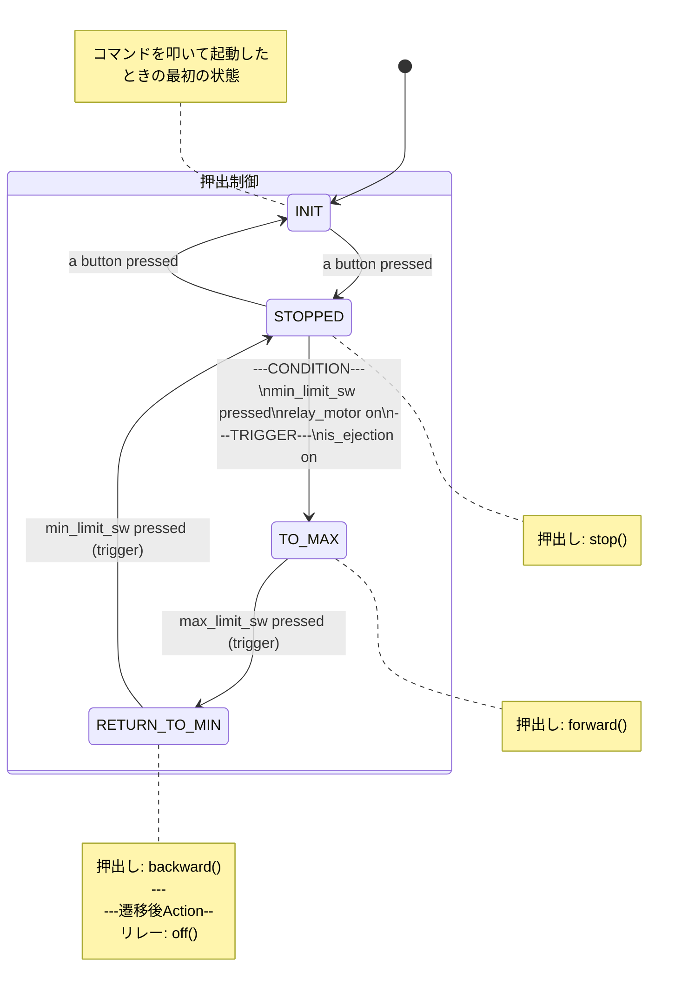

# Lifting Motor

This package contains the ROS2 node for the lifting motor.

```mermaid
%%{init: {'theme': 'default', 'themeVariables': { 'handDrawn': true }}}%%
stateDiagram
    [*] --> INIT

    state 押出制御 {
        INIT --> STOPPED: a button pressed
        STOPPED --> INIT: a button pressed
        STOPPED --> TO_MAX: ---CONDITION---\nmin_limit_sw pressed\nrelay_motor on\n---TRIGGER---\nis_ejection on
        TO_MAX --> RETURN_TO_MIN: max_limit_sw pressed (trigger)
        RETURN_TO_MIN --> STOPPED: min_limit_sw pressed (trigger)
    }

    note left of INIT
        コマンドを叩いて起動したときの最初の状態
    end note
    note right of STOPPED
        押出し: stop()
    end note
    note right of TO_MAX
        押出し: forward()
    end note
    note right of RETURN_TO_MIN
        押出し: backward()
        ---
        ---遷移後Action--
        リレー: off()
    end note
```
